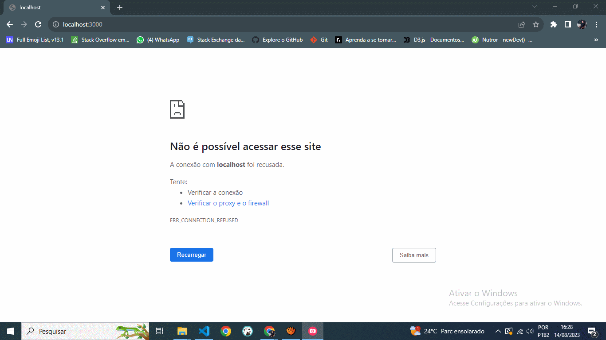

# 🕹 Jogo Multiplayer

Projeto de criação de um Jogo Multiplayer utilizando SocketIO, JavaScript e HTML5.
- [Playlist](https://www.youtube.com/watch?v=0sTfIZvjYJk)

## Pré-requisitos

Visual Studio Code  

NPM  

Navegador

## Uso
 - rode: npm install
 - rode: npm start
 - aceite a instalação do Nodemon
 - para jogar abra seu navegador em: http://localhost:3000/

## 🛠 Ferramentas

- [JavaScript](https://developer.mozilla.org/pt-BR/docs/Web/JavaScript)
- [HTML](https://developer.mozilla.org/pt-BR/docs/Web/HTML)
- [SOCKETIO](https://socket.io/)

## Contribuição

Se você tem alguma Sugestão enviar para devandersonmotta@gmail.com com o assunto: "contribuição sitess" ou entre em contato pelo Linkedin.

## Licença

MIT

## ✉ Contato

email: devandersonmotta@gmail.com

linkedin: www.linkedin.com/in/anderson-motta-96b138235
---

## 💡 Objetivo

Praticar e adquirir conhecimento sobre comunicação em tempo real com SocketIO. 

